# Core-Practical-Project

For my second project in QA Academy, I have been tasked to create an application that generates an 'Object' upon an set of predefined rules.
The application will be based on a service-based architecture with 4 services.

These functions all rely on each other. Service 1 will be the front-end which will display the results from the other 3 services. Service 1 will do this by sending http requests to service 2, 3 & 4 and then outputting the data to the webpage and storing it in a SQL database. 
Service 2 & 3 will randomly generate an object which will then be used in service 4.

The application itself is rather simple and not much code is needed. This is because the main focus of this project is to use the technologies that are widely used in DevOps and ensure they are implemented correctly and are functioning properly. These technologies include:

* Using Docker to containerise our application and Docker Swarm to orchestrate the containers
* Using ansible to automate tasks and provision servers & roles
* Using NGINX as a load balancer, allowing the use of a reverse proxy
* Using Jenkins pipeline to automate testing and deployment, utilising webhools from my GitHub repository

## MLB Draft Pick Generator

The application I am going to make will genrate a random position with service 2, genrate a random pick in service 3 and then have service 4 pick a random team based on the pick and return a string to service 1.

# Contents

* [Design](#Design)
    * [Database](#Database)
    * [Risk Assessment](#Risk-Assessment)
* [Project Tracking](#Project-Tracking)
* [Continuous Integration and Development (CI/CD)](Continuous-Integration-and-Development-(CI/CD))
* [Architecture](#Architecture)
    * [Docker-Compose](#Docker-Compose)
    * [Docker Swarm](#Docker-Swarm)
    * [NginX](#NginX)
    * [Ansible](#Ansible)
* [Service Configuration](#Service-Configuration)
* [Testing](#Testing)
* [Front-end Design](#Front-end-Design)
* [Future Improvements](#Future-Improvements)

# Design

## Database

Below is the table in the SQL database for this application.

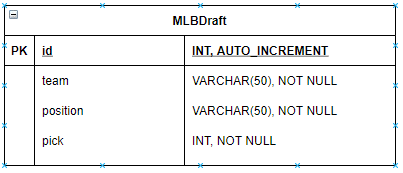

## Risk Assessment

Below is a risk management outlining some risks and their severity.

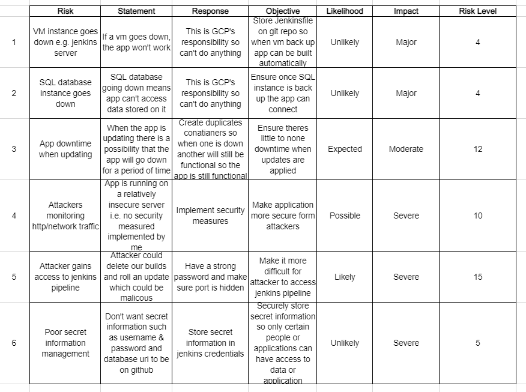

# Project Tracking

I created a Trello board to help me track my progress throughout the development. You can view it ve clicking [here](https://trello.com/b/MhQbXRrV/practical-project).

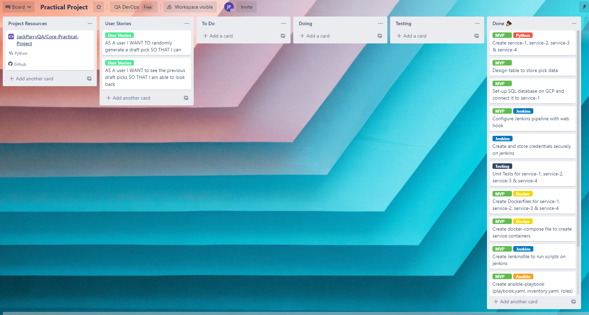

# Continuous Integration and Development (CI/CD)

For this project I implemented a CI/CD pipeline to allow for automation of  development into live builds. Below is a diagram that helps visualise and explain the CI/CD pipeline.

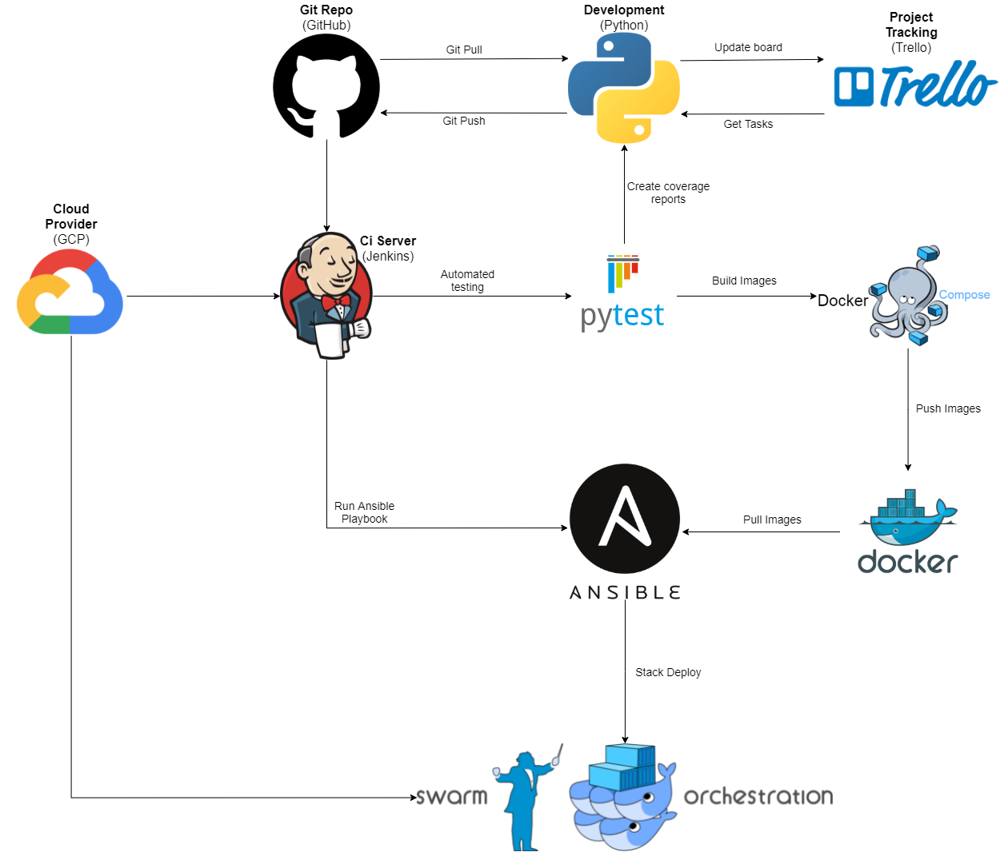

To implement the pipeline into the project, I set up a Jenkins pipeline as shown below.

As shown in above, there are 6 main steps in the pipeline:

1. **Install Requirements:** Install all the required packages & software
2. **Test:** Runs pytest for all 4 services with coverage report
3. **Build:** Builds the images for the 4 services
4. **Push:** Pushes the images to my Docker Hub
5. **Configuration Management (Ansible):** The Ansible-Playbook is run, which starts NGINX, configures the Docker Swaem and adds a manager and a worker to the swarm
6. **Deploy:** The Docker Stack is deployed onto the manager node with the docker-compose.yaml and the enviroment variables are also set on the manager node

# Architecture

## Docker-Compose

The first framework is used and set up was Docker-Compose. Docker-Compose is a tool for defining and running multi-container docker applications. The docker-compose.yaml file is required for this and is run by using the command docker-compose up -d after all the docker images are built which can be done by running the command docker-compose build --parallel. Docker images are built using a Dockerfile which is located in each service directory.

## Docker Swarm

Docker Swarm is a container orchestration tool. This allows you to manage multiple conatainers deployed across multiple host machines.

This project application is made up of multiple containers and so benefits from the ability to move scale across multiple nodes which is where Docker swarm comes in. It automatically maintains the project with replacing any failed conatianers and manages rolling updates. There are 4 VM instances used for this machine and Docker Swarm uses them to construct one system that users access. The diagram below shows how this is applied.

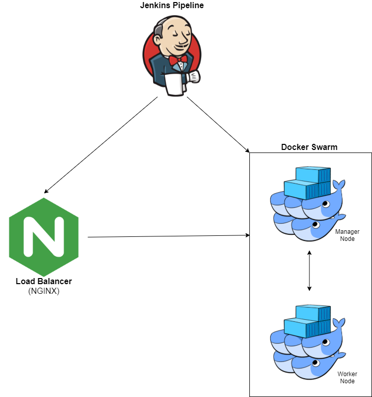

## NginX

For this project I used Nginx for load balancing the application and as reverse proxy. Basically when a user connects to the website NginX will divert you to a container with the least load to help with performance. It also adds an aditional layer of security.

## Ansible

Ansible is a software provisioning configuration management and application deployment tool.

So instead of going to each VM and setting up the build environment, such as installing docker or initalising the swarm and adding nodes, we can use an ansible-playbook to autonomously set up the build environement on each machine.

Ansible works by sending the commands in the playbook through SSH. The only thing needed to be configured is the SSH keys for each machine.

# Service Configuration

Below I have outlined how the 4 services work with each other.

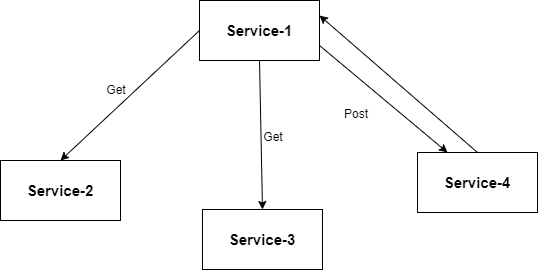

Service-1 is the front-end i.e. what the user will see. It also stores the data on the database. To get the data http requests are utilised. There is a get request for both service-2 & service-3 and a post request for service-4 posting the data received from service-2 & service-3.

Service-2 picks a random position from a list of position I've created and returns that object to service-1.

Service-3 generates a random number (pick) between 1 & 30 (1st implementation) or 31 & 60 (2nd implementation) and returns it to service-1.

Service-4 receives the data posted and with that data return a random team based on whether the pick is even or odd. 
* 1st implemetation: If pick is even return random NLteam, odd return random ALTeam.
* 2nd implemetation: If pick is even return random ALteam, odd return random NLTeam.

Service-4 also returns a string which describes the pick and is output on service-1 web page.

# Testing

Pytest was used to test the application for this project. Using unit test mocking to allow us to mock http requests which we wouldn't be able to do using normal unit test methods. The tests are automated using Jenkins which means my test script is run everytime the project is built. Below are the test results for each of my services.

### Service-1:

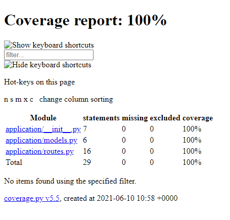

### Service-2

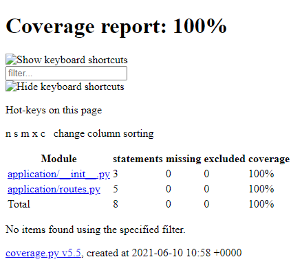

### Service-3

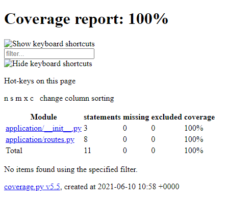

### Service-4

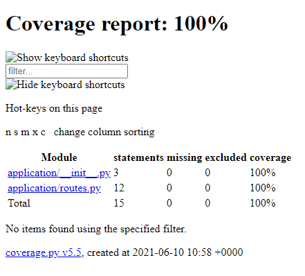

# Front-end Design

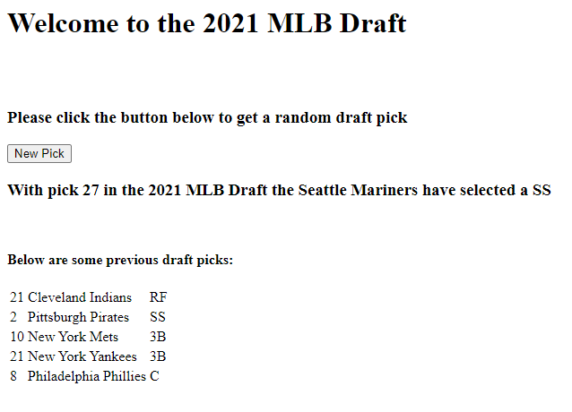

Below is what the user would see when they enter the website. You have abutton to click which simply reloads the page to generate the new objects which are displayed the the line of text below it. Below that is the previous 5 picks that have been generated and stored in the database.

# Future Improvements

* Improve CSS design.
* Possibly add names of players.
* Allow user to select which round of the draft they want a pick from. Could also be from anywhere in the draft or multiple rounds.
* Allow users to create a mock draft of selected rounds.
* Implement a button that sends http requests instead of a button that simply refreshes the page.
