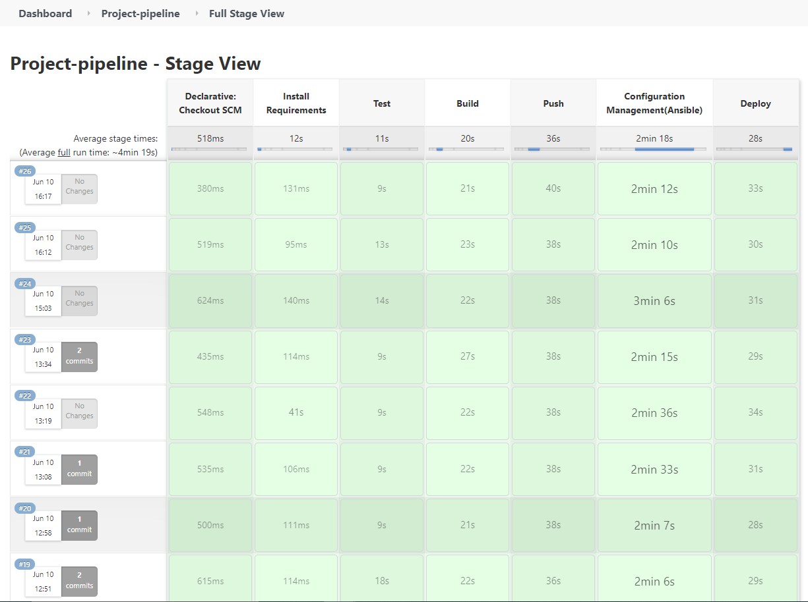

# Core-Practical-Project

For my second project in QA Academy, I have been tasked to create an application that generates an 'Object' upon an set of predefined rules.
The application will be based on a service-based architecture with 4 services.

These functions all rely on each other. Service 1 will be the front-end which will display the results from the other 3 services. Service 1 will do this by sending http requests to service 2, 3 & 4 and then outputting the data to the webpage and storing it in a SQL database. 
Service 2 & 3 will randomly generate an object which will then be used in service 4.

The application itself is rather simple and not much code is needed. This is because the main focus of this project is to use the technologies that are widely used in DevOps and ensure they are implemented correctly and are functioning properly. These technologies include:

* Using Docker to containerise our application and Docker Swarm to orchestrate the containers
* Using ansible to automate tasks and provision servers & roles
* Using NGINX as a load balancer, allowing the use of a reverse proxy
* Using Jenkins pipeline to automate testing and deployment, utilising webhools from my GitHub repository

## MLB Draft Pick Generator

The application I am going to make will genrate a random position with service 2, genrate a random pick in service 3 and then have service 4 pick a random team based on the pick and return a string to service 1.

# Contents

# Design

## Database

Below is the table in the SQL database for this application.

## Risk Assessment

Below is a risk management outlining some risks and their severity.

# Project Tracking

I created a Trello board to help me track my progress throughout the development. You can view it ve clicking [here](https://trello.com/b/MhQbXRrV/practical-project).

# Continuous Integration and Development (CI/CD)

For this project I implemented a CI/CD pipeline to allow for automation of  development into live builds. Below is a diagram that helps visualise and explain the CI/CD pipeline.

To implement the pipeline into the project, I set up a Jenkins pipeline as shown below.

As shown in above, there are 6 main steps in the pipeline:

1. **Install Requirements:** Install all the required packages & software
2. **Test:** Runs pytest for all 4 services with coverage report
3. **Build:** Builds the images for the 4 services
4. **Push:** Pushes the images to my Docker Hub
5. **Configuration Management (Ansible):** The Ansible-Playbook is run, which starts NGINX, configures the Docker Swaem and adds a manager and a worker to the swarm
6. **Deploy:** The Docker Stack is deployed onto the manager node with the docker-compose.yaml and the enviroment variables are also set on the manager node

## Architecture

## Service Configuration

